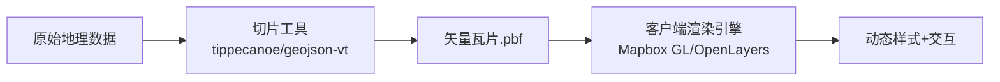
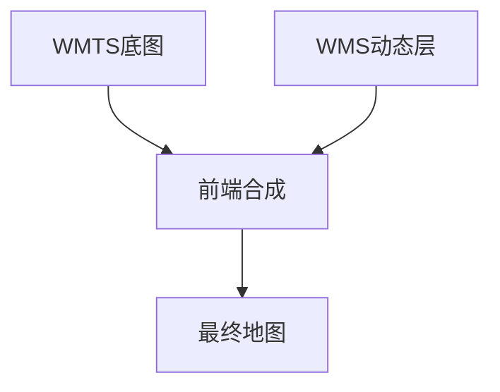

确实如此，**GIS（地理信息系统）技术栈虽然工具不同（OpenLayers、Mapbox、ArcGIS、SuperMap 等），但核心术语和原理是相通的**。下面我为你系统整理一份：

---

# ✅ GIS 相关专业术语汇总（作用 + 使用场景）

分类清晰、面试/项目常用，建议熟练掌握。

---

## 🗺️ 一、坐标系与投影

| 术语                          | 作用                    | 使用场景                  |
| --------------------------- | --------------------- | --------------------- |
| **WGS84**（EPSG:4326）        | 全球 GPS 默认经纬度坐标系       | 原始 GPS 数据、GeoJSON     |
| **Web Mercator**（EPSG:3857） | 地图投影坐标系（单位：米），适合浏览器渲染 | 地图底图、WebGIS 瓦片地图统一坐标系 |
| **CGCS2000**（EPSG:4490）     | 中国大地坐标系统（北斗）          | 政府测绘、精确制图             |
| **GCJ-02**                  | 高德、腾讯坐标（火星坐标）         | 需要坐标纠偏的场景             |
| **BD-09**                   | 百度地图坐标系               | 百度地图数据展示              |
| **投影**                      | 将地球球面坐标转换为平面坐标的过程     | 统一底图与图层、避免错位、地图渲染     |
| **坐标转换**                    | 不同坐标系之间的转换            | 数据融合、GIS分析准确叠加        |

---

## 🗂️ 二、图层与数据结构

| 术语                   | 作用                            | 使用场景                      |
| -------------------- | ----------------------------- | ------------------------- |
| **图层（Layer）**        | 地图中的逻辑图层，管理同类空间要素             | 面积图层、道路图层、POI图层等          |
| **要素（Feature）**      | 地图上的点、线、面等几何对象                | 一个城市、道路、多边形区域等            |
| **几何（Geometry）**     | 点、线、面数据结构                     | 空间定位、图形绘制                 |
| **矢量数据**             | 离散的点、线、面，属性丰富、可交互             | 区划边界、POI、道路、建筑物等          |
| **栅格数据**             | 像素网格数据，每个像素有值（颜色或数值）          | 遥感图像、地形、热力图、DEM           |
| **GeoJSON**          | 常用的地理数据格式，基于 JSON             | WebGIS 可视化、接口数据传输         |
| **Shapefile (.shp)** | 传统桌面 GIS 矢量数据格式               | ArcGIS、QGIS、GeoServer 等使用 |
| **MVT（矢量瓦片）**        | 切片化后的矢量数据（Mapbox Vector Tile） | 高性能地图渲染、样式动态配置            |
| **栅格瓦片**             | 切片化的图片地图（PNG/JPG）             | OSM/谷歌地图底图，遥感影像           |

---

## 🌍 三、地图服务与标准（OGC）

| 术语                               | 作用                  | 使用场景                   |
| -------------------------------- | ------------------- | ---------------------- |
| **OGC**                          | 地理信息领域国际标准组织        | GeoServer、ArcGIS 等服务对接 |
| **WMS（Web Map Service）**         | 返回地图图片（PNG/JPG）     | 图像地图展示、背景底图            |
| **WMTS（Web Map Tile Service）**   | 返回地图瓦片（切片）          | 高性能地图切片展示              |
| **WFS（Web Feature Service）**     | 返回矢量要素（GeoJSON/GML） | 查询属性数据、空间分析            |
| **WCS（Web Coverage Service）**    | 栅格数据服务（DEM、遥感）      | 地形分析、水文模拟等             |
| **SLD（Styled Layer Descriptor）** | 地图图层样式配置标准          | 图层动态渲染样式               |

---

## 🧮 四、空间分析与操作

| 术语                                   | 作用              | 使用场景           |
| ------------------------------------ | --------------- | -------------- |
| **缓冲区分析（Buffer）**                    | 计算目标对象周围的区域     | 计算学校周边 500 米范围 |
| **叠加分析（Overlay）**                    | 多图层空间相交、合并      | 分析污染区与居民区重叠区域  |
| **空间查询（Spatial Query）**              | 查询某图层中符合地理条件的要素 | 查询区域内所有 POI    |
| **拓扑关系（Within/Intersects/Contains）** | 判断要素之间空间关系      | 判断点是否在多边形内     |
| **热力图（Heatmap）**                     | 根据密度生成热度图       | 展示人流、车流密度      |
| **缓冲/裁剪/合并**                         | 矢量处理操作          | 空间数据处理分析       |

---

## 🖼️ 五、可视化与样式

| 术语                          | 作用             | 使用场景                  |
| --------------------------- | -------------- | --------------------- |
| **样式表达式（Style Expression）** | 基于属性值动态设置颜色/大小 | 根据人口设置圆点大小            |
| **Popup/Marker**            | 地图交互弹窗、图标      | 显示 POI 信息、设备状态        |
| **图层过滤（Filter）**            | 只显示符合条件的图层内容   | 只显示 status=online 的设备 |
| **图层控制（图层开关）**              | 控制哪些图层可见       | 多图层切换展示               |
| **label/text**              | 要素文字标注         | 城市名、POI 名称            |

---

## 🧱 六、开发相关术语（WebGIS）

| 术语                   | 作用            | 使用场景             |
| -------------------- | ------------- | ---------------- |
| **OpenLayers**       | WebGIS 开源渲染引擎 | 政务平台、地图服务        |
| **Mapbox GL JS**     | 矢量地图 WebGL 引擎 | 商业级地图、可视化应用      |
| **Leaflet**          | 简洁轻量地图库       | 移动端地图、简单展示       |
| **GeoServer**        | 开源地图服务发布平台    | WMS/WFS/WCS 服务提供 |
| **Mapbox Studio**    | 样式编辑器         | 自定义地图外观          |
| **Turf.js**          | GIS 分析库       | Web 端缓冲、相交、测距等   |
| **proj4js**          | 坐标转换库         | GCJ02 → WGS84 等  |
| **deck.gl**          | WebGL 可视化叠加库  | 大规模点云、3D渲染       |
| **CesiumJS**         | 三维地球引擎        | 3D 地图、模型可视化      |
| **SuperMap iClient** | 商业 GIS SDK    | 政企项目，支持 2D/3D    |

---

## 📚 七、数据与瓦片术语

| 术语          | 说明                      | 使用场景                |
| ----------- | ----------------------- | ------------------- |
| **XYZ 瓦片**  | `{z}/{x}/{y}` 命名规则瓦片    | 常见于 OSM、Google Maps |
| **TMS 瓦片**  | Tile Map Service，Y 轴向上  | QGIS/部分 WMS 使用      |
| **MBTiles** | SQLite 瓦片文件格式           | 离线地图、移动端应用          |
| **.pbf**    | Protocol Buffer 格式的矢量瓦片 | MVT 的核心文件格式         |
| **DEM**     | 数字高程模型                  | 地形渲染、三维建模           |
| **影像瓦片**    | 航片或遥感影像切片               | 卫星地图、历史图像展示         |

---

## ✅ 小结

GIS 专业术语数量不少，但核心逻辑统一：

* **坐标统一 → 投影**
* **数据组织 → 图层/要素**
* **地图展示 → 瓦片/样式/弹窗**
* **数据处理 → 空间分析**
* **服务互通 → OGC/WMS/WFS**

---

如果你正在准备面试，我还可以提供：

* GIS 面试高频问答（适用于前端 + GIS 联合岗位）
* 各术语英文对照简明表
* WebGIS 项目架构图（前后端协作）

需要的话，随时告诉我。


矢量瓦片（Vector Tiles）和栅格瓦片（Raster Tiles）是两种不同的地图数据组织方式，它们在数据存储、传输、渲染和交互性上有本质区别：

---

### **1. 数据本质区别**
| **特性**         | **矢量瓦片**                          | **栅格瓦片**                          |
|------------------|--------------------------------------|--------------------------------------|
| **数据格式**     | 几何数据（点/线/面）+ 属性数据        | 像素矩阵（图片）                     |
| **文件格式**     | `.pbf` (Protocol Buffers)、GeoJSON   | `.png`、`.jpg`、`.webp`              |
| **数据内容**     | 原始地理要素（道路/建筑轮廓等）       | 预渲染的静态图片                     |
| **数据结构**     | 分层存储（道路层/建筑层等）           | 单一像素层                           |

---

### **2. 渲染方式对比**
| **特性**         | **矢量瓦片**                          | **栅格瓦片**                          |
|------------------|--------------------------------------|--------------------------------------|
| **渲染位置**     | **客户端渲染**（浏览器/移动端）       | **服务端渲染**（预生成图片）          |
| **缩放效果**     | 无级缩放（任意级别不失真）            | 阶梯缩放（需预切多级瓦片）            |
| **样式修改**     | 动态实时修改（客户端即时生效）        | 需重新生成所有瓦片                    |
| **渲染负载**     | 客户端承担计算                        | 服务端承担计算                        |

---

### **3. 性能与效率**
| **指标**         | **矢量瓦片**                          | **栅格瓦片**                          |
|------------------|--------------------------------------|--------------------------------------|
| **传输体积**     | ⭐⭐⭐⭐ 极小（仅传输数据）              | ⭐⭐ 较大（传输整张图片）             |
| **渲染速度**     | ⭐⭐ 首屏较慢（需客户端解析渲染）       | ⭐⭐⭐⭐ 首屏快（直接显示图片）         |
| **缩放流畅度**   | ⭐⭐⭐⭐ 平滑无级缩放                   | ⭐⭐ 阶梯式跳变（需加载新级别瓦片）   |
| **更新效率**     | ⭐⭐⭐⭐ 局部更新数据即可               | ⭐ 需重新生成整片区域瓦片             |

---

### **4. 功能特性差异**
| **能力**         | **矢量瓦片**                          | **栅格瓦片**                          |
|------------------|--------------------------------------|--------------------------------------|
| **动态交互**     | ✅ 支持要素级交互（点击/悬停）        | ❌ 仅图片级交互                       |
| **样式定制**     | ✅ 客户端实时切换样式                 | ❌ 样式固定                           |
| **多分辨率适配** | ✅ 自动适配Retina屏                   | ❌ 需生成@2x/@3x瓦片                  |
| **3D地形**       | ✅ 支持（如Mapbox GL地形）            | ❌ 不支持                             |
| **动态数据**     | ✅ 实时更新要素属性                   | ❌ 静态不可变                         |

---

### **5. 技术实现对比**
**矢量瓦片工作流**：


**栅格瓦片工作流**：


---

### **6. 典型应用场景**
| **场景**               | **推荐方案**         | **原因**                              |
|------------------------|----------------------|--------------------------------------|
| 高交互地图应用         | 矢量瓦片             | 需要素级交互/动态样式                |
| 移动端离线地图         | 矢量瓦片             | 数据体积小，节省存储                 |
| 静态地图展示           | 栅格瓦片             | 部署简单，兼容性好                   |
| 卫星影像/航拍图        | 栅格瓦片             | 本身就是像素数据                     |
| 实时交通路况           | 矢量瓦片             | 需动态更新道路属性                   |
| 历史地图归档           | 栅格瓦片             | 无需交互，长期稳定保存               |

---

### **7. 可视化对比**
| **特性**         | **矢量瓦片**                     | **栅格瓦片**                     |
|------------------|----------------------------------|----------------------------------|
| **缩放至22级**   |      |  |
| **要素交互**     |     |      |
| **样式切换**     |     |     |

---

### **总结选择建议**
- **选矢量瓦片**当需要：
  - 高清显示（任意缩放级别）
  - 动态交互（点击查询/悬停高亮）
  - 实时样式切换
  - 频繁数据更新
  - 移动端离线使用

- **选栅格瓦片**当需要：
  - 快速简单部署
  - 兼容老旧设备（无WebGL）
  - 显示卫星/航拍影像
  - 静态地图展示（历史地图等）
  - 服务端渲染能力有限

现代地图应用（如Mapbox、Google Maps新版）已全面转向矢量瓦片技术，而传统GIS系统和卫星影像仍广泛使用栅格瓦片。两者也可混合使用（如矢量底图+栅格卫星图层）。


是的，**栅格瓦片（Raster Tiles）** 根据服务协议和切片规则的不同，可以细分为 **WMS（Web Map Service）** 和 **WMTS（Web Map Tile Service）** 两种主要类型。它们在数据传输方式、服务架构和适用场景上有显著区别：

---

### **WMS 与 WMTS 的核心区别**
| **特性**               | **WMS**                          | **WMTS**                         |
|------------------------|----------------------------------|----------------------------------|
| **协议标准**           | OGC WMS 1.1/1.3                  | OGC WMTS 1.0                     |
| **数据返回形式**       | **动态生成**的单一地图图片       | **预切分**的标准化瓦片（如256x256像素） |
| **请求方式**           | `GetMap` + BBOX参数              | `GetTile` + 行列号/级别          |
| **性能特点**           | 实时渲染，高服务端负载           | 静态缓存，高并发性能好           |
| **适用场景**           | 动态数据、小范围请求             | 全球级底图、高频访问场景         |

---

### **1. WMS（Web Map Service）**
#### **核心特点**
- **动态渲染**：每次请求时，服务端实时生成地图图片（如通过GeoServer/MapServer）。
- **灵活性强**：支持自定义BBOX、图层叠加、样式（SLD）和输出格式（PNG/JPEG/SVG）。
- **典型请求示例**：
  ```url
  http://example.com/wms?service=WMS&version=1.3.0
  &request=GetMap&layers=roads,rivers
  &bbox=116.3,39.9,116.4,40.0&width=800&height=600
  &srs=EPSG:4326&format=image/png
  ```

#### **优缺点**
| **优点**                          | **缺点**                          |
|-----------------------------------|-----------------------------------|
| ✅ 实时数据（如气象/交通）        | ❌ 高延迟（需实时渲染）           |
| ✅ 支持复杂查询（`GetFeatureInfo`）| ❌ 服务端压力大                   |
| ✅ 任意范围/比例尺请求            | ❌ 不适合大范围高频访问           |

#### **适用场景**
- 需要实时数据的专题图（如地震监测）
- 小范围动态样式地图（如规划调整）
- 基于属性的复杂查询（如点击查询地块信息）

---

### **2. WMTS（Web Map Tile Service）**
#### **核心特点**
- **预切瓦片**：地图预先按固定网格（如Google Maps的XYZ方案）切分为瓦片并缓存。
- **高效缓存**：支持CDN加速，适合全球级底图服务。
- **典型请求示例**：
  ```url
  http://example.com/wmts?layer=basemap&style=default
  &tilematrixset=GoogleMapsCompatible&tilematrix=10
  &tilerow=1024&tilecol=2048&format=image/png
  ```

#### **优缺点**
| **优点**                          | **缺点**                          |
|-----------------------------------|-----------------------------------|
| ✅ 极低延迟（CDN友好）            | ❌ 数据更新需重新切瓦片           |
| ✅ 高并发支持（静态文件）          | ❌ 灵活性差（固定比例尺/范围）    |
| ✅ 标准化切片方案（如TMS/XYZ）     | ❌ 无法动态叠加图层               |

#### **适用场景**
- 全球底图服务（如OpenStreetMap/天地图）
- 移动端离线地图（预下载瓦片包）
- 卫星影像/航拍图展示

---

### **3. 技术对比深度解析**
#### **(1) 请求参数差异**
| **参数**       | **WMS**                          | **WMTS**                         |
|----------------|----------------------------------|----------------------------------|
| 范围定义       | `BBOX`（任意范围）               | `TileMatrix+TileRow+TileCol`（固定网格） |
| 比例尺控制     | `WIDTH/HEIGHT` + `BBOX`动态计算  | 预定义的`TileMatrixSet`级别       |
| 图层混合       | 支持多图层合并请求               | 仅支持单图层请求                 |

#### **(2) 性能对比测试**
```python
# 模拟100次请求的响应时间（单位ms）
wms_times = [120, 115, 130, ...]  # 动态渲染波动大
wmts_times = [15, 16, 14, ...]     # 缓存响应稳定
```

#### **(3) 缓存机制**
- **WMS**：需依赖HTTP缓存头（如`Cache-Control`），但动态内容常被禁用缓存。
- **WMTS**：天然支持永久缓存（瓦片URL不变则直接复用）。

---

### **4. 混合使用场景**
现代GIS系统常组合使用两者：
1. **WMTS** 提供底图（如街道/地形）
2. **WMS** 叠加动态图层（如实时交通/气象）


---

### **5. 如何选择？**
- **选WMS当**：
  - 数据更新频率高（>1次/分钟）
  - 需要动态样式或属性查询
  - 自定义非标准比例尺

- **选WMTS当**：
  - 底图数据基本不变
  - 需要全球/大范围覆盖
  - 高并发访问需求

---

### **6. 主流工具支持**
| **工具**       | **WMS**支持          | **WMTS**支持         |
|---------------|----------------------|----------------------|
| GeoServer     | ✅ 原生支持          | ✅ 需配置网格集       |
| MapServer     | ✅ 完整实现          | ✅ 通过`TILEINDEX`    |
| QGIS          | ✅ 客户端加载        | ✅ 支持TMS/XYZ        |
| OpenLayers    | ✅ `ImageWMS`源      | ✅ `WMTS`源           |
| Leaflet       | ✅ 插件实现          | ✅ 原生支持           |

---

### **关键结论**
- **WMTS是栅格瓦片的优化版**：通过预切片解决WMS的性能瓶颈。
- **WMS更灵活，WMTS更高效**：类似"定制外卖" vs "快餐"的区别。
- **现代趋势**：静态底图用WMTS+矢量瓦片，动态数据用WMS或实时API。